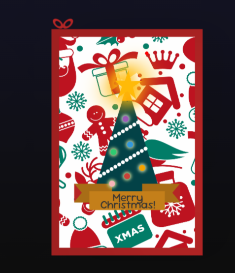

# Simple HTML, CSS, and JavaScript Christmas Greeting Card

This is a festive and interactive Christmas greeting card created using HTML, CSS, and JavaScript. The card features a clean, elegant design with holiday-themed decorations like Christmas trees, snowflakes, and a cheerful greeting.

## Features

- **HTML**: The structure is straightforward, with a central message area and decorative elements.
- **CSS**: Used to style the card with vibrant colors and smooth animations to create a festive atmosphere.
- **JavaScript**: Adds interactivity, such as displaying a countdown to Christmas or revealing a hidden message when a button is clicked.

This greeting card is a perfect way to send holiday cheer to friends and family in a fun and creative way!

<table style="width:100%; table-layout:fixed;">
  <tr>
    <td style="width:50%; text-align:center;">
      
Front Card

      
    </td>
  </tr>
  <tr>
    <td style="width:50%; text-align:center;">
      
Inner Card

      
    </td>
  </tr>
</table>